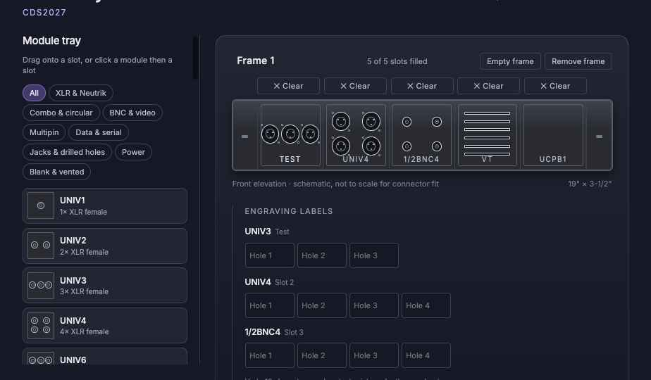

# UCP Panel Builder

An interactive layout tool for **Middle Atlantic FK2** connector panels — the 2RU
(3-1/2"), 19" rack frame that accepts five UCP punchout modules across a single tier.

Drag modules onto the frame, name each frame, engrave a label under every hole, and
read off a parts list you can print straight to PDF.



> Reference layout tool. Confirm connector fit and part numbers against the current
> Middle Atlantic UCP documentation before ordering.

---

## What it does

| | |
| --- | --- |
| **Frame layout** | A schematic front elevation of the FK2 at a true 19" × 3-1/2" aspect, with the five slots drawn to scale. Punchouts render at their real proportions from each module's hole pattern. |
| **Module tray** | All 59 modules, searchable (code, name, connector type — e.g. "powercon", "etherCON", "snake") and filterable by category. Drag onto a slot, or click a module and then click a slot. |
| **Multiple frames** | Add as many FK2 frames as the job needs; each gets its own name, slots and labels. |
| **Racks** | Group frames into named racks, each with as many FK2 frames as it needs. Move a frame to another rack from its header; remove a rack together with its frames. |
| **Move plates** | Drag a placed module onto another slot — in any frame — to move it, or to swap it with the module already there. Its name and engravings go with it. |
| **Per-hole engraving** | Type a short label for each individual hole in a module. Labels show under the hole on the panel drawing and are collected per-frame in a sidebar. Blanks and vents have nothing to engrave. |
| **Parts list** | A live bill of materials — the FK2 frame kits plus every module, quantity-rolled across all frames, with published part numbers. With more than one rack, a per-rack breakdown follows the job total. |
| **Module catalog** | The full reference table, grouped by category. |
| **Save / open** | Work autosaves to the browser. Use **Save file** / **Open file** to move a project (racks, frames, slots and labels) as JSON. Older files without racks open into a single rack. |
| **PDF export** | Print with a job name stamped on the sheet. Choose *Panel + parts list* or *Panel only*; UI chrome drops out of the print. |

### Module catalog

59 modules in 8 categories:

- **D-size (pick inserts)** — universal D-size plates (`UNIV1`–`UNIV6`): click a hole (or use
  the sidebar) to pick its insert — XLR3 M/F, DMX XLR5, combo, 1/4", RCA, Toslink, speakON,
  etherCON / Cat6A, opticalCON DUO / QUAD, SDI / 12G-SDI BNC, HDMI, USB A/B, USB-C, blank.
  Each insert is listed in the parts list.
- **Audio & speaker** — XLR male in, combo XLR / 1/4", 4-bolt circular (speakON, Cannon EP), dual banana
- **Video** — 1/2" BNC groups, Canare, HDMI feedthroughs (1, 2, 4)
- **Data** — DB9, DB15 / HD15, DB25, DB37
- **Multipin & snake** — VEAM 8/12/24-pair, Elco 38/56/90, Whirlwind, Cannon DL96
- **Power** — powerCON 20, powerCON TRUE1, twistlock, duplex AC outlets, Socapex 19
- **Drilled holes** — 1/4", 3/8", 7/16" holes
- **Blank & vented** — `UCPB1` blank, `VT` vented blank

Part numbers follow Middle Atlantic's own inconsistency: the `UCP-` prefix appears on
the XLR-female family (`UCP-UNIV4`) and the vent module (`UCP-VT`); every other module
is listed by its bare code (`1/2BNC4`, `2ELCO38`).

---

## Running it

The page pulls React 18, ReactDOM and Babel from unpkg at runtime, so it needs an
**internet connection**. Serve it over HTTP rather than opening the file directly — the
runtime re-fetches the page's own source on boot, which `file://` blocks.

### With Docker

```bash
docker compose up -d --build
# then open http://localhost:8000
```

The image is `nginx:alpine` serving the static files; `/` redirects to the page. Change
the host port in `compose.yaml`. Rebuild after editing any file.

### Without Docker

```bash
python3 -m http.server 8000
# then open http://localhost:8000/UCP%20Panel%20Builder.dc.html
```

Projects persist to `localStorage` under `ucp-fk2-project`; **Save file** exports the
same data as a portable JSON file.

---

## Repo layout

```
UCP Panel Builder.dc.html   The whole app: markup template + component logic
support.js                  Design-canvas runtime (generated — do not edit)
image-slot.js               User-fillable image placeholder component (starter scaffold)
_ds/nocturne-…/             Nocturne design system: tokens, styles, component classes
screenshots/                Reference captures
Dockerfile, compose.yaml    Container image (nginx) and run config
nginx.conf                  Server config: static files, / → the page
```

### `UCP Panel Builder.dc.html`

A single-file design-canvas component, in two halves:

- **The template** (inside `<x-dc>`) — plain HTML with `{{ }}` bindings and `<sc-for>` /
  `<sc-if>` control flow.
- **The logic** (inside `<script type="text/x-dc">`) — a `Component extends DCLogic`
  class holding state (`frames`, `filter`, `picked`, `over`) and a `renderVals()` that
  returns everything the template binds to.

The hole geometry is computed, not drawn by hand. `grid(cols, rows, w, h, r)` lays out a
punchout pattern in real inches against the module face and converts to percentages, so
every module's holes are positioned consistently and scale with the frame.

Three props are exposed to the canvas editor: **Show Export to PDF button**,
**What the PDF contains** (`Panel + parts list` / `Panel only`), and
**Job name printed on the sheet**.

### `_ds/` — Nocturne

The design system the panel is styled with: a quiet, compact dark interface on a
near-neutral blue-grey ground, Inter at medium weight, 8px radii, and a single blurple
accent used as a line and a glow rather than a flood. Every color, font, space, radius
and shadow comes from a CSS variable in `styles.css` — see
[`_ds/nocturne-…/readme.md`](_ds/nocturne-56349b84-ffe9-4905-9825-98d3ee5d0820/readme.md)
for the full guide.
